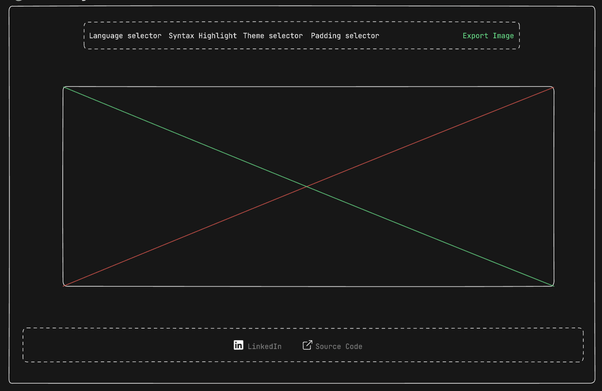

## Code To Image Web Application

### Wireframe

Setup was started by creating a wireframe which serves as an adumbration of the code editor, with this the placement of each feature is predetermined.



## Description

The code editor was created using the [react-ace](https://www.npmjs.com/package/react-ace) package among other tools.

```bash
   import AceEditor from "react-ace";

      <AceEditor
        value="function() {return 'Hello'}"
        name="UNIQUE_ID_OF_DIV"
        theme="cobalt"
        mode={"javascript"}
        wrapEnabled
        fontSize={14}
        highlightActiveLine
        showGutter={false}
        showPrintMargin={false}
        editorProps={{ $blockScrolling: true }}
      />
```

For ease of resizing the editor, the [re-resizable](https://www.npmjs.com/package/re-resizable) package was used.

```bash
   import { Resizable } from "re-resizable";

    <Resizable maxWidth={1000} minHeight={460} minWidth={500}>
      <AceEditor
        value="function() {return 'Hello'}"
        name="UNIQUE_ID_OF_DIV"
      />
    </Resizable>
```

The header component of the editor is nested with 3 similar but distinct components, All selector components excluding the `PaddingSelector` and `BackgroundSelector` share the same Dropown setup.
```bash
  page.tsx
```

```bash
      <header
        className="flex"
      >
        <LanguageSelector />
        <ThemeSelector />
        <BackgroundSelector />
        <PaddingSelector />
      </header>
```

```bash
  Dropdown.tsx
```

```bash
  const Dropdown = forwardRef(function Dropdown(
    { label, options, type, handleChange }: DropdownProps,
    ref: ForwardedRef<HTMLDivElement> | RefObject<HTMLDivElement>
  ) {
    const { isOn, toggle, setOff } = useToggle();

    useOnClickOutside(ref as RefObject<HTMLDivElement>, setOff);
    return (
      <div ref={ref as ForwardedRef<HTMLDivElement>} onClick={toggle}>
        <p className="py-[5px] text-sm font-medium">Code Colors</p>
        <div className="dropdown-title capitalize w-[120px] hover:text-slate-50 transition-all duration-300 ease-in-out">
          {label} <ChevronDown />
        </div>
        {isOn && (
          <div className="dropdown-menu relative top-[94px] w-[120px]">
            {options.map((option, i) => {
              const name =
                type === EditorType.language
                  ? (option as LanguageType).name
                  : (option as string);
              return (
                <button
                  key={i}
                  onClick={() => handleChange?.(type, option)}
                  className=" capitalize text-left hover:text-slate-50 transition-all duration-300 ease-in-out"
                >
                  {name}
                </button>
              );
            })}
          </div>
        )}
      </div>
    );
  });
```

Also, the code editor's title `Add-Title` on page mount has be made editable in such a way that the extension of the selected language remains while changes to the title are being made. This implementation was made in a separate custom hook attached uniquely to the `CodeEditor.tsx` file.
```bash
    // Extract the title without the extension
    function handleChangeTitle(e: ChangeEvent<HTMLInputElement>) {
    const newTitle = e.target.value.split(".")[0];
    setTitle(newTitle);
  }
```

Also, using the [html2canvas](https://www.npmjs.com/package/html2canvas), it's been made possible to download the editor as a png file.

## Assets
[!Screenshot](/public/screenshot-1.png)

## Getting Started

First, run the development server:

```bash
npm install

# or possibly you could decide whatever package manager suits you as listed below

yarn dev
# or
pnpm dev
```

Open [http://localhost:3000](http://localhost:3000) with your browser to see the result.

## Deploy on Vercel

Deployment is on vercel
